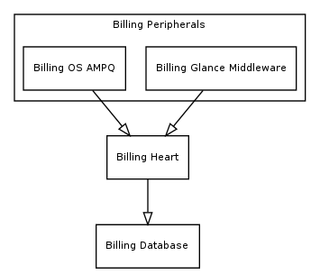
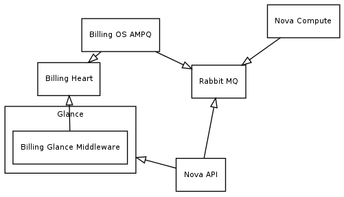

Architecture
============

Nova Billing consists of several parts that are split into two groups:

1. Nova Billing Heart. 

2. Nova Billing Peripherals.
 

Nova Billing Heart
------------------

This is the main part of Nova Billing. The Heart is a RESTful service that stores information in a database.
This information includes resources, accounts, events, and tariffs.

The Heart is not tied to particular resource types (i.e. instances, images, floating IPs, etc.). It allows to save
and retrieve information of resource of any type.

The Heart saves information about current tariffs, but not about their historical changes.

The Heart provides bills for requested accounts. A bill includes information about charged money on the requested time period.

Nova Billing Peripherals
------------------------
These components are specific to resource types. A peripheral listens to system events and notifies the Heart through REST interface.

Billing OS AMQP listens to OpenStack RabbitMQ queues and notifies the Heart about instance and volumes.

Billing Glance Middleware runs in Glance's address space and notifies the Heart about images.
